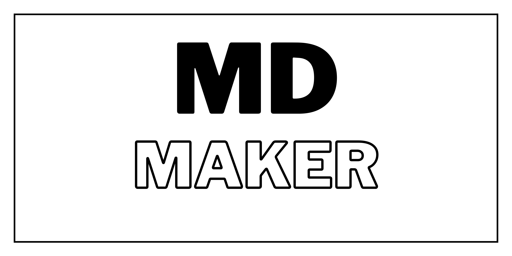

# MDMaker

Welcome to MDmaker, the hassle-free solution for generating high-quality contributing.md and code_of_conduct.md files for your projects. Say goodbye to manual creation and let MDmaker streamline your documentation process with its intuitive interface and customizable templates.

## Features
- **✨ Effortless Documentation -**  Save time and effort with MDmaker's automated generation of contributing.md and code_of_conduct.md files. Focus on building remarkable projects while MDmaker takes care of the documentation.

- **🌟 Intuitive Interface -** MDmaker's user-friendly interface makes it accessible to developers of all skill levels. Whether you're a beginner or an experienced coder, you'll find MDmaker a breeze to use.

- **🚀 Open-Source and Free -** MDmaker is an open-source tool available to everyone at no cost. Join our vibrant community of developers and contribute to making documentation a seamless experience for all.

## Demo

  

https://github.com/theritikchoure/MDMaker/assets/56495602/02160356-8424-4f8b-8ed9-195b843a5454

## Contributing

We welcome contributions to improve ScreenWiz and make it even better. To contribute, please follow these steps:

1. Fork the repository and create your branch from the `main` branch.
2. Make your changes, ensuring they align with the project's coding style and guidelines.
3. Test your changes thoroughly to ensure they work as expected.
4. Commit your changes and push them to your forked repository.
5. Submit a pull request, clearly explaining the changes you have made.

## Feedback and Support
If you have any questions, suggestions, or issues regarding MDMaker, please feel free to open an issue. We appreciate your feedback and will address any concerns as quickly as possible.

## License
MDMaker is released under the MIT License. You are free to use, modify, and distribute this software for personal or commercial purposes.

## Acknowledgements
MDMaker would not have been possible without the valuable contributions of the open-source community. We would like to express our gratitude to all the developers who have contributed to the libraries
